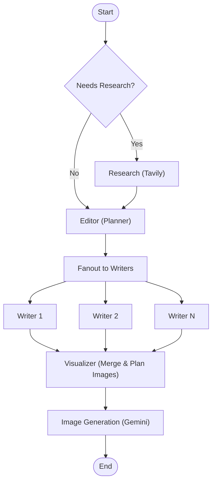

# NexusWriter 

**NexusWriter** is a next-generation AI blogging agent designed for modularity and scalability. It autonomously researches, plans, writes, and visualizes technical content using a graph-based agentic workflow.

## Key Features

- **Modular Architecture**: Built with a clean `src/` package structure separating concerns.
- **Hybrid Interface**: 
  - **Streamlit**: Beautiful, interactive UI for generation.
  - **FastAPI**: Production-ready API endpoints (`src/api.py`).
- **Smart Strategies**: Automatically switches between *Deep Dive* (Evergreen) and *News Flash* (Real-time) modes.
- **Top-Tier Models**: Powered by Groq's `openai/gpt-oss-120b` (or similar) and Google Gemini for visuals.

## Tech Stack

- **Backend Logic**: Python, LangGraph, LangChain
- **API**: FastAPI
- **Frontend**: Streamlit
- **AI Providers**: Groq (LLM), Tavily (Search), Google (Images)

## Getting Started

### 1. Installation

```bash
# Clone the repo
git clone <your-repo-url>
cd NexusWriter

# Install dependencies
pip install -r requirements.txt
```

### 2. Configuration

Set up your `.env`:
```env
GROQ_API_KEY=...
TAVILY_API_KEY=...
GOOGLE_API_KEY=...
```

### 3. Usage

**Run the UI (Frontend):**
```bash
streamlit run app.py
```

**Run the API (Backend):**
```bash
uvicorn src.api:app --reload
```
Access docs at `http://127.0.0.1:8000/docs`.

## Architecture

- `app.py`: The presentation layer (Streamlit).
- `src/graph.py`: The brain (LangGraph workflow).
- `src/agents/`: Individual agent logic (Router, Editor, Writer, Visualizer).
- `src/tools/`: Interfaces for external tools.


